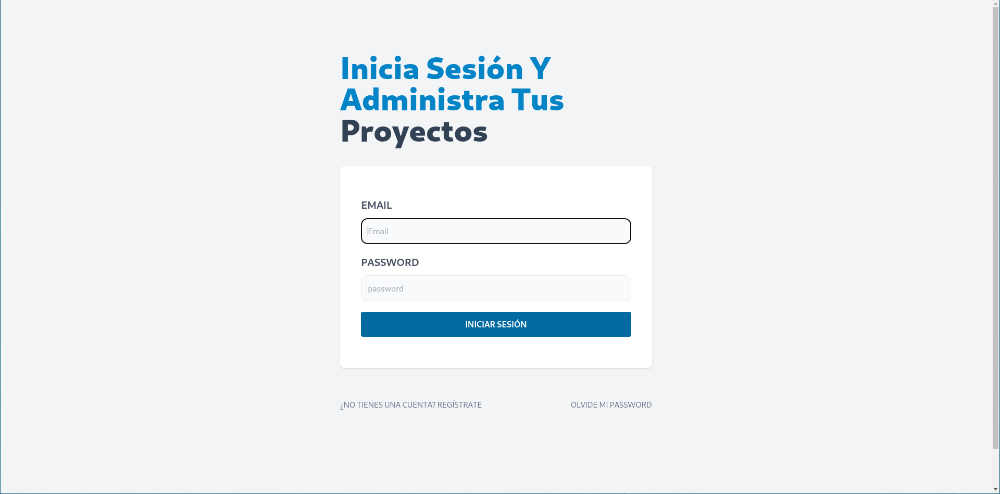
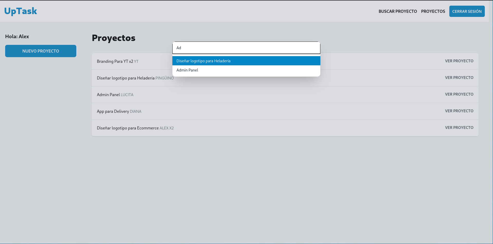
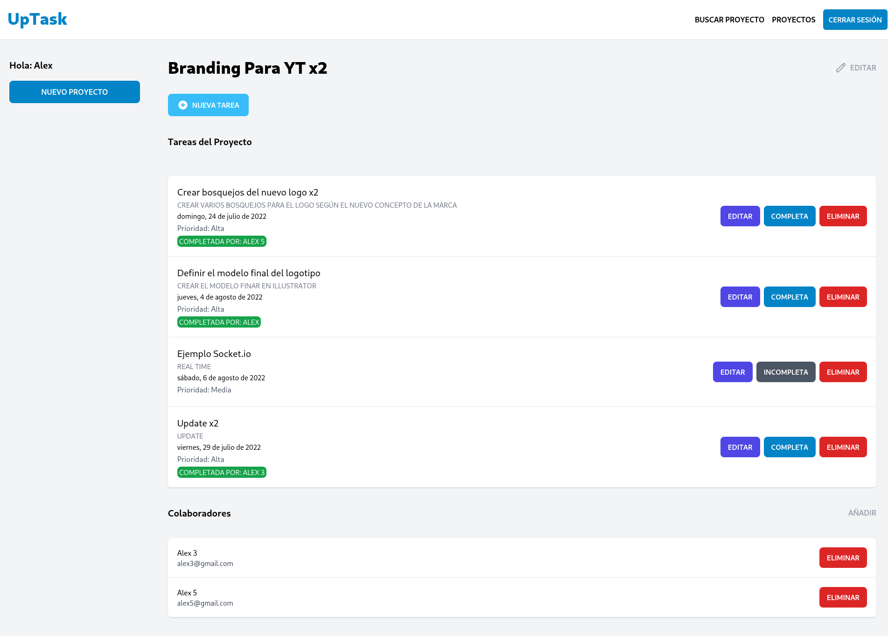
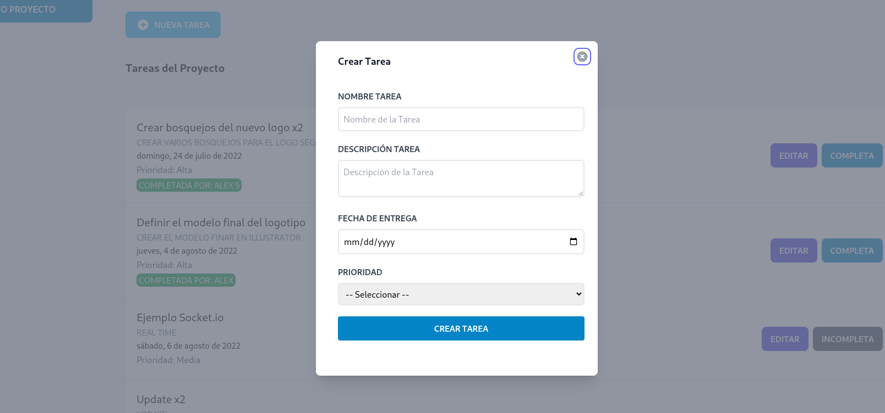
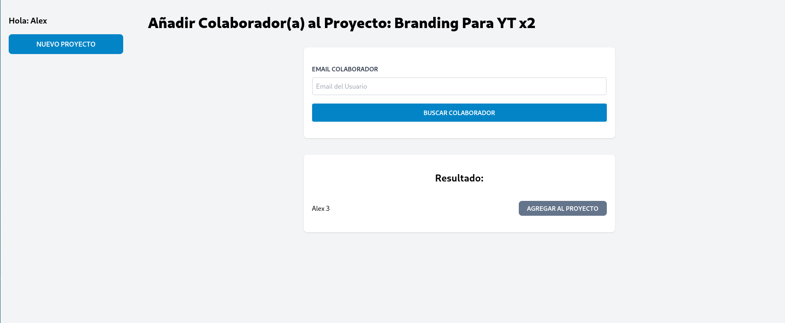

# UpTask - MERN

## Tecnologies
  - MERN Stack
  - Socket.io
  - Tailwind CSS
  - Headless UI
  - Context API


## Running the app

```
# install dependencies with yarn:
yarn install

# or npm:
npm i


# run in dev mode on port 3000:
yarn dev

# or:
npm run dev


# generate production build:
yarn build

# or:
npm run dev
```

## View demo

[Demo](https://uptask-mern-io-adrlx.netlify.app/)

​

## Screenshots






